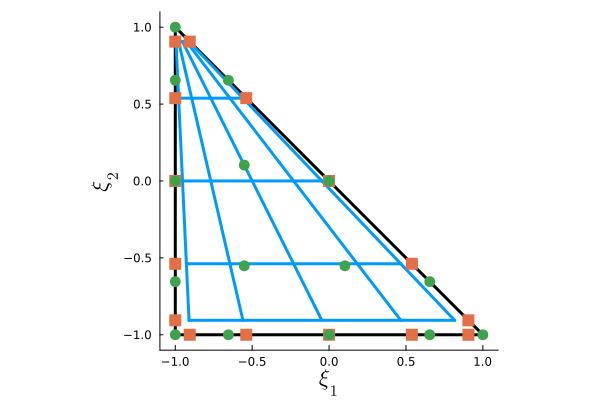
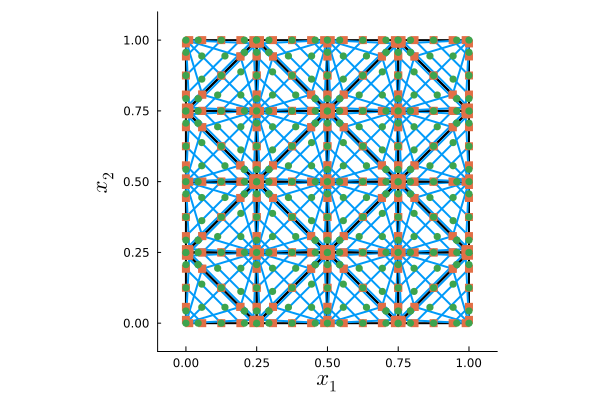

# Module `SpatialDiscretizations`

## Overview
Discretizations in StableSpectralElements.jl are constructed by first building a local approximation on a canonical reference element, denoted generically as $\hat{\Omega} \subset \mathbb{R}^d$, and using a bijective transformation $\bm{X}^{(\kappa)} : \hat{\Omega} \rightarrow \Omega^{(\kappa)}$ to construct the approximation on each physical element of the mesh $\mathcal{T}^h = \{ \Omega^{(\kappa)}\}_{\kappa \in \{1:N_e\}}$ in terms of the associated operators on the reference element. An example of such a mapping is shown below.


In order to define the different geometric reference elements, existing subtypes of `AbstractElemShape` from StartUpDG.jl (e.g. `Line`, `Quad`, `Hex`, `Tri`, and `Tet`) are used and re-exported by StableSpectralElements.jl. For example, we have 
```math
\begin{aligned}
\hat{\Omega}_{\mathrm{line}} &= [-1,1],\\
\hat{\Omega}_{\mathrm{quad}} &= [-1,1]^2,\\
\hat{\Omega}_{\mathrm{hex}} & = [-1,1]^3, \\
\hat{\Omega}_{\mathrm{tri}} &= \big\{ \bm{\xi} \in [-1,1]^2 : \xi_1 + \xi_2 \leq 0 \big\},\\
\hat{\Omega}_{\mathrm{tet}} &= \big\{ \bm{\xi} \in [-1,1]^3 : \xi_1 + \xi_2 + \xi_3 \leq -1 \big\}.
\end{aligned}
```
These element types are used in the constructor for StableSpectralElements.jl's `ReferenceApproximation` type, along with a subtype of `AbstractApproximationType` specifying the nature of the local approximation (and, optionally, the associated volume and facet quadrature rules). As an example, we can construct a collapsed-edge tensor-product spectral-element method of degree $p=4$ on the reference triangle by first loading the StableSpectralElements.jl package and then using the appropriate constructor:

```julia
julia> using StableSpectralElements

julia> reference_approximation = ReferenceApproximation(NodalTensor(4), Tri(), 
    mapping_degree=4, quadrature_rule=(LGQuadrature(4), LGQuadrature(4)))
```
Note that we have used the optional keyword argument `mapping_degree` to define a degree $l = 4$ multidimensional Lagrange basis to represent the geometric transformation $\bm{X}^{(\kappa)} \in [\mathbb{P}_l(\hat{\Omega})]^d$, where by default an affine mapping is used, corresponding to $l = 1$. Moreover, the keyword argument `quadrature_rule` has been used to specify a Legendre-Gauss quadrature rule with $p+1$ nodes in each direction. Using the [Plots.jl recipes](https://docs.juliaplots.org/latest/recipes/) defined in StableSpectralElements.jl, we can easily visualize the reference element for such a discretization:
```julia
julia> using Plots

julia> plot(reference_approximation, grid_connect=true, markersize=6, linewidth=3)
```


In the above, the blue grid lines are used to represent the tensor-product volume quadrature rule, the orange squares represent facet/mortar quadrature nodes, and the green circles represent the Lagrange interpolation nodes used to define the mapping.

All the information used to define the spatial discretization on the physical domain $\Omega$ is contained within a `SpatialDiscretization` structure, which is constructed using a `ReferenceApproximation` and a `MeshData` from StartUpDG.jl, which are stored as the fields `reference_approximation` and `mesh`. When the constructor for a `SpatialDiscretization` is called, the grid metrics are computed and stored in a `GeometricFactors` structure, with the corresponding field being `geometric_factors`. StableSpectralElements.jl provides utilities to easily generate uniform periodic meshes on line segments, rectangles, or rectangular prisms; using such a mesh and `reference_approximation` defined previously, we can construct a spatial discretization on the domain $\Omega = [0,1] \times [0,1]$ with four edges in each direction (a total of $N_e = 32$ triangular elements) as shown below:

```julia
julia> mesh = uniform_periodic_mesh(reference_approximation, ((0.0, 1.0),(0.0,1.0), (4,4)))

julia> spatial_discretization = SpatialDiscretization(mesh, 
    reference_approximation.reference_element)
```
Note that the field `reference_element` is of type `RefElemData` from StartUpDG, and is used to store geometric information about the reference element and to define the operators used in constructing the polynomial mapping; the operators used for the discretizations are defined separately according to the specific scheme (e.g. `NodalTensor` in this case). We can now visualize the discretization on the mesh:

```julia
julia> plot(spatial_discretization, grid_connect=true, mapping_nodes=true)
```

